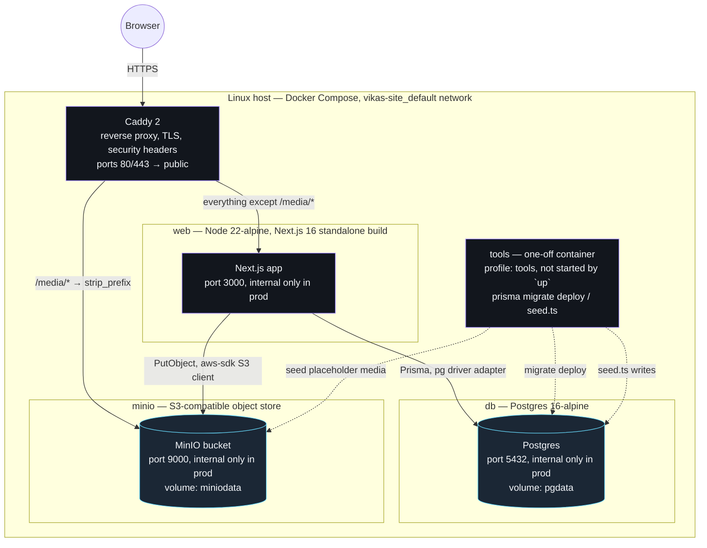
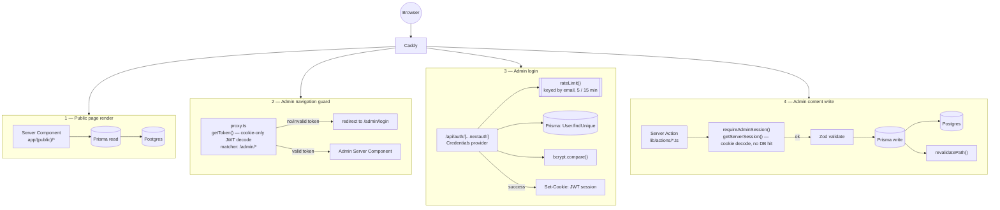
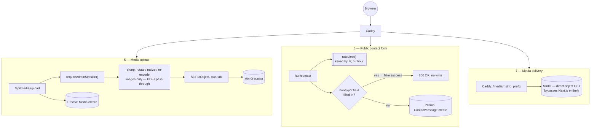

# Architecture & Data Flow

Two diagrams, both traced directly from `docker/docker-compose.yml`,
`docker/docker-compose.prod.yml`, `docker/Caddyfile`, `proxy.ts`, and the
`lib/auth` / `lib/storage` / `app/api` code — not aspirational.

Scope note: this is a single-server, single-Docker-Compose-stack personal
site (one app instance, one Postgres, one MinIO), not a distributed
multi-service system. There's deliberately no HA topology, service mesh, or
multi-region diagram here — those would describe an architecture this site
doesn't have. What's below is calibrated to what actually runs.

## 1. System architecture (production topology)

**Dev vs. prod, the actual difference (not two architectures):**
`docker-compose.yml` (dev, used by `make up`) publishes `db`, `minio`, and
`web` directly on host ports (5432, 9000–9001, 3000) and has no `caddy`
service at all — the Next.js dev/standalone server is hit directly. The
`docker-compose.prod.yml` override (used by `make deploy`) is additive: it
adds the `caddy` service as the sole public entrypoint and overrides
`ports: []` on `db`/`minio`/`web` so nothing but Caddy is reachable from
outside the Docker network. Same containers, same images — production just
removes direct access and puts one TLS-terminating proxy in front.

## 2. Data flow

Seven request paths, each traced to the actual code that handles it. Split
into two charts (request/auth paths, then storage paths) so each stays
readable instead of one diagram wide enough to need horizontal scrolling.

**Notes that don't fit in the diagram:**
- Both auth checks (`proxy.ts`'s `getToken()` and `requireAdminSession()`'s
  `getServerSession()`) decode the JWT cookie only — neither hits the
  database, matching next-auth v4's JWT session strategy (required for the
  Credentials provider). The Prisma adapter wired into `authOptions` is
  unused for session persistence; it's there for a possible future provider.
- `proxy.ts` only guards page navigation to `/admin/*` (Next's own guidance:
  an "optimistic," DB-free check that runs on every request including
  prefetches). It does **not** cover `/api/*` — every Server Action and API
  route re-checks `requireAdminSession()` itself, which is the authoritative
  check.
- Rate limiting (`lib/rateLimit.ts`) is in-memory and per-process — it resets
  on container restart and won't hold across multiple `web` replicas (there's
  only one today).
